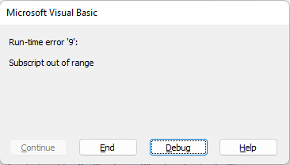

# Analyzing stocks with VBA

## Overview of Project
This project uses VBA to show key market performance metrics for a basket of 12 stocks in 2017 and 2018. 

We begin with two Excel worksheets that contain daily pricing and volume data for these stocks in each year. Our VBA macro pulls from that data to display (on 
another sheet) the total daily volume and price change for each stock in a year chosen by the user. The user can run the macro from the output sheet by clicking a 
button that asks them to input the year of their choice. This works as long as data for their chosen year is available in the workbook (2017 or 2018 in this case).

## Results
Results of this analysis show that 2017 was a good year for these particular stocks, with all but TERP seeing price appreciation during the year. Three-quarters of
these stocks posted double- or even triple-digit price increases in 2017. The following year was tough for the most part. Only ENPH and RUN showed price 
appreciation in 2018, and half the stocks posted double-digit price declines.


  TotalVolume = 0

  Worksheets(yearValue).Activate
    For j = 2 To RowCount
    
      If Cells(j, 1).Value = Ticker Then
               
        TotalVolume = TotalVolume + Cells(j, 8).Value
            
      End If
```      
            
My goal in refactoring the code is to avoid a dozen loops through all the rows of stock price data, which I hope will cut down on the program run time. In order to 
achieve this, we have to find and store the relevant metrics (total volume, starting price and ending price) for each ticker along the way while only looping 
through once. 

The purpose of the TickerIndex variable is to tell us which ticker index number we're working with at any given time. I thought that instead of starting with a For 
loop that loops through each ticker in turn, we need to start with a For loop that loops through all the rows of data.

But then I got stuck on instruction 2a ("Create a for loop to initialize the TickerVolumes to zero") because I wasn't quite sure what I should be looping through. After thinking about this for way too long, I decided that the point was to reset the TickerVolumes every time we move to a new TickerIndex number. Doing this 
does not actually run through the data rows 12 times, since it's separate from the For loop that WILL run the data rows.

```
    For TickerIndex = 0 To 11
    
        TickerVolumes(TickerIndex) = 0
    
    Next i
```

Then after playing around with this, I realized that you can just set this For i = 0 to 1, since 

```
  '2a) Create a for loop to initialize the tickerVolumes to zero.
    
    For i = 0 To 1
    
        TickerVolumes(i) = 0
    
    Next i
```

I assumed we still needed the separate Ticker variable, so I set it right after creating the TickerIndex but before creating the three output arrays. It turns 
out we don't need it since the TickerIndex variable is selecting the ticker symbols from the Tickers array for us.

```
    '1a) Create a ticker Index
    'and set it to zero
    TickerIndex = 0
    
    'I think we need to set the Ticker variable, too.
    Ticker = Tickers(TickerIndex)

    '1b) Create three output arrays
    Dim TickerVolumes(TickerIndex) As Long
    Dim TickerStartingPrices(TickerIndex) As Single
    Dim TickerEndingPrices(TickerIndex) As Single
```

VBA did not like this. When I tested my code by stepping through it using the debugging tool, I got an error about this line:

```
'1b) Create three output arrays
    Dim TickerVolumes(TickerIndex) As Long
    Dim TickerStartingPrices(TickerIndex) As Single
    Dim TickerEndingPrices(TickerIndex) As Single
```


I decided to move forward by typing the number of tickers in parentheses instead of TickerIndex. Fortunately, this made the error go away.

```
 '1b) Create three output arrays
    Dim TickerVolumes(12) As Long
    Dim TickerStartingPrices(12) As Single
    Dim TickerEndingPrices(12) As Single
```

There may be a better way of declaring these arrays. To Do: Review this about dynamic arrays: https://www.automateexcel.com/vba/declare-dim-create-initialize-array/ 
Although maybe dynamic arrays are for something else and you just need to know how many elements are in your array when you declare it. 

But then another error! This time about the line of code in which I increase the volume for current ticker:

```
''2b) Loop over all the rows in the spreadsheet.
    For i = 2 To RowCount
    
        '3a) Increase volume for current ticker
        TickerVolumes(TickerIndex) = TickerVolumes(TickerIndex) + Cells(i, 8).Value
```




I kept trying to use TickerIndex in places where I just needed to use i.
Overflow error https://excelchamps.com/vba/overflow-error-6/


It also seems unnecesary to activate the output sheet ("All stocks analysis") twice. The original module code has us activating the output worksheet near the beginning
of the subroutine in order to set up data headers. 

```
Sub AllStocksAnalysis()

    Dim startTime As Single
    Dim endTime As Single

    yearValue = InputBox("For which year would you like to analyze stock performance?")

    startTime = Timer

    'Format the output sheet on the "All stocks analysis" worksheet.
    Worksheets("All stocks analysis").Activate
        
    Range("A1").Value = "All stocks (" + yearValue + ")"
            
    'Set up the data headers
    Cells(3, 1).Value = "Ticker"
    Cells(3, 2).Value = "Total daily volume"
    Cells(3, 3).Value = "Return"
```

Then we activate the sheet containing the stock price data ("2017" or "2018", depending on the user's choice of year for analysis) and run through the various
For loops and conditional statements that gather and store the appropriate data. As part of the outer For loop that runs through each ticker, we re-activate the 
output sheet and populate it with the data gathered from the previous sheet for each ticker. 

I would like to see if adding the column headers to the output sheet while we already have it activated during the data population process makes the code less 
bulky and/or speeds up the run time.

```

