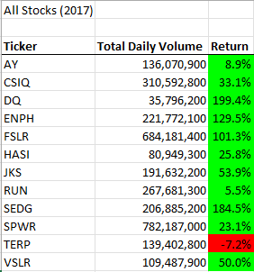
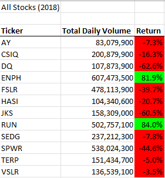
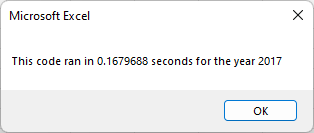
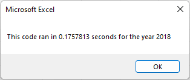
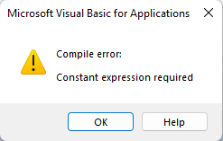

# Analyzing stocks with VBA

## Overview of Project
This project uses VBA to show key market performance metrics for a basket of 12 stocks in 2017 and 2018. 

We begin with two Excel worksheets that contain daily pricing and volume data for these stocks in each year. Our VBA macro pulls from that data to display (on 
another sheet) the total daily volume and price change for each stock in a year chosen by the user. The user can run the macro from the output sheet by clicking a 
button that asks them to input the year of their choice. This works as long as data for their chosen year is available in the workbook (2017 or 2018 in this case).

## Results
Results of this analysis show that 2017 was a good year for these particular stocks, with all but TERP seeing price appreciation during the year. Three-quarters of
these stocks posted double- or even triple-digit price increases in 2017. The following year was tough for the most part. Only ENPH and RUN showed price 
appreciation in 2018, and half the stocks posted double-digit price declines.

         

The original VBA module code had us looping through all the rows of stock price data 12 times — once for each ticker — each time finding the relevant 
metrics for that ticker. For example, below are the beginning of the original For loop and the conditional statement that let us run through each row looking 
for — and adding up — the total daily volume numbers for each of the 12 tickers in our Tickers array.

```     
For i = 0 To 11
    
  Ticker = tickers(i)
  TotalVolume = 0

  Worksheets(yearValue).Activate
    For j = 2 To RowCount
    
      If Cells(j, 1).Value = Ticker Then
               
        TotalVolume = TotalVolume + Cells(j, 8).Value
            
      End If
```      

Refactoring the code allows us to avoid many loops through all the rows of stock price data, which decreases the program run time from more than 1 second to
less than 0.2 second.

      

In order to achieve this, we have to find and store the relevant metrics (total volume, starting price and ending price) for each ticker along the way while only 
looping through once. Instead of a For loop that loops through each ticker in turn (as in the original code), we use a For loop that loops through all the rows of 
data once.

An important tool here is the TickerIndex variable that will tell the computer which ticker index number we're working with at any given time as we loop through
the data later.

``` 
    '1a) Create a ticker Index and set it to zero
    TickerIndex = 0
```

The TickerIndex will ultimately be used as the index in the arrays that we create to hold the volume, starting price and ending price variables as we loop
through the rows of stock performance data (once) and store these metrics for each ticker.

```
    '1b) Create three output arrays
    Dim TickerVolumes(12) As Long
    Dim TickerStartingPrices(12) As Single
    Dim TickerEndingPrices(12) As Single
```

But before we start looping through the stock data, we need to make sure that our TickerVolumes start at zero, as we will later add each stock's cumulative 
figures for each day. At first I thought we might need to do this 12 times (for i = 0 to 11), but it actually only needs to happen once.

```
    For i = 0 To 1
    
        TickerVolumes(i) = 0
    
    Next i

```

Then we start looping! For example, below is the part of the For loop that loops through the stock data and adds up the daily volume figures for each
stock. It uses the TickerIndex to keep track of which stock it is on.

```
    '2b) Loop over all the rows in the spreadsheet.
    For i = 2 To RowCount
    
        '3a) Increase volume for current ticker
        TickerVolumes(TickerIndex) = TickerVolumes(TickerIndex) + Cells(i, 8).Value
```


## Summary
Refactoring our code made it run much more quickly and smoothly. I do not find the new code much easier to read, but it presumably places less strain
on one's computer. 

One challenge in refactoring is the need to grasp higher levels of data abstraction. For example, arrays are very powerful, but they are more complicated to 
understand than individual variables. This project found me frequently trying to use certain variables in places where they were useless (or worse than useless).

I had assumed we still needed the separate Ticker variable from the original module code, so I set it right after creating the TickerIndex but before 
creating the three output arrays. It turns out we don't need it since the TickerIndex variable is selecting the ticker symbols from the Tickers array for us.

My first big problem in refactoring this code was figuring out why we needed separate For loops to initialize the TickerVolumes to zero and how to make that 
happen. After puzzling through that, my main problems largely stemmed from trying to use TickerIndex in places where it did not elong. For example, VBA did not 
like this:

```
'1b) Create three output arrays
    Dim TickerVolumes(TickerIndex) As Long
    Dim TickerStartingPrices(TickerIndex) As Single
    Dim TickerEndingPrices(TickerIndex) As Single
```



Typing the number of tickers (12) in parentheses instead of TickerIndex made the error go away. I was incorrectly trying to create a dynamic array when what I 
really needed to do was enter the number of elements in each array. This resource about dynamic arrays may be helpful for the future: 

https://www.automateexcel.com/vba/declare-dim-create-initialize-array/ 

```
 '1b) Create three output arrays
    Dim TickerVolumes(12) As Long
    Dim TickerStartingPrices(12) As Single
    Dim TickerEndingPrices(12) As Single
```

I also mistakenly tried to use TickerIndex instead of i in the below For loop. Fixing the resulting bug helped me better understand what exactly we're doing in a For loop and what the actual purpose of the TickerIndex variable is.

```
'4) Loop through your arrays to output the Ticker, Total Daily Volume, and Return.
    For i = 0 To 11

        Worksheets("All Stocks Analysis").Activate
        
         
        Cells(4 + i, 1).Value = Tickers(i)
        Cells(4 + i, 2).Value = TickerVolumes(i)
        Cells(4 + i, 3).Value = TickerEndingPrices(i) / TickerStartingPrices(i) - 1


    Next i
```
